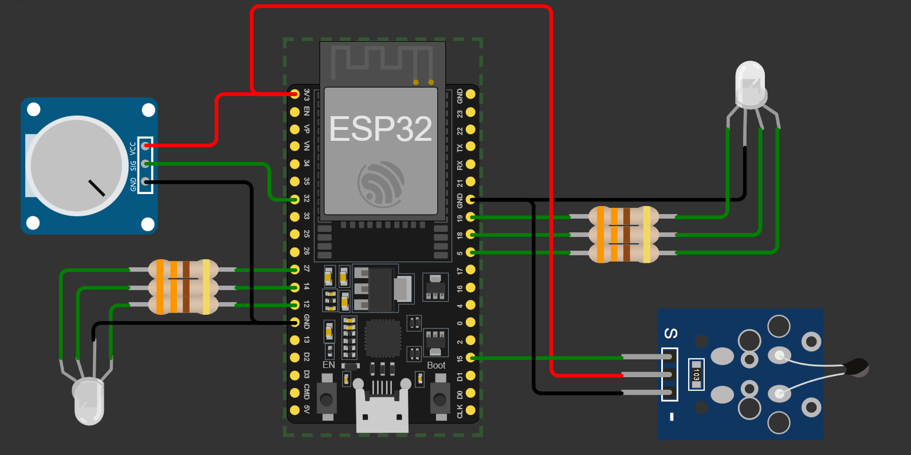

| Supported Targets | ESP32 | ESP32-C2 | ESP32-C3 | ESP32-C5 | ESP32-C6 | ESP32-H2 | ESP32-P4 | ESP32-S2 | ESP32-S3 |
| ----------------- | ----- | -------- | -------- | -------- | -------- | -------- | -------- | -------- | -------- |

# Parcia #1 - Sistemas en tiempo real
# Integrantes: Javier Leonardo Guzman, Brayan Avendaño Mesa.

El código permite gestionar un sistema basado en un LED RGB, un potenciómetro, un sensor de temperatura NTC y una comunicación UART. Su funcionamiento se divide en tres partes principales:
## Control del brillo y color del LED RGB
- Se regula la intensidad de brillo de cada color (rojo, verde y azul) del LED RGB mediante un potenciómetro.
- Un botón físico permite alternar entre los diferentes colores disponibles, cambiando el canal de control del LED RGB.
- La configuración del brillo y color se actualiza en tiempo real utilizando señales PWM generadas con LEDC.

## Asignación de rangos de temperatura a colores específicos

- Se establecen rangos de temperatura a través de comandos UART enviados por el usuario.
- El código mide la temperatura con un sensor NTC y determina en qué rango se encuentra.
Dependiendo del rango, se enciende el color correspondiente en el LED RGB.
- La comunicación UART es bidireccional: el sistema recibe comandos de configuración y responde con información sobre el estado actual del LED y la temperatura.

## Activación y desactivación de la transmisión de datos

- A través de comandos UART, el usuario puede habilitar o deshabilitar la transmisión de la temperatura en el monitor serial.
- Cuando está activada, la temperatura se envía cada 2 segundos mediante UART.
- Si está desactivada, el sistema sigue midiendo la temperatura, pero sin mostrarla en el monitor serial.

Esta implementación permite un control eficiente del LED RGB en función de la temperatura ambiente, mientras que la comunicación UART facilita la interacción y personalización del sistema en tiempo real.



## Ejemplo de carpeta de contenido
```
├── CMakeLists.txt
├── main
│   ├── CMakeLists.txt
|   |__ ADC_library.c
|   |__ ADC_library.h
|   |__ ADC_NTC.c
|   |__ ADC_NTC.h
|   |__ COMMANDS_UART.c
|   |__ COMMANDS_UART.H
|   |__ led_RGB_library.c
|   |__ led_RGB_library.h
|   |__ LED_RGB.c
|   |__ LED_RGB.h
│   └── main.c
└── README.md  


                